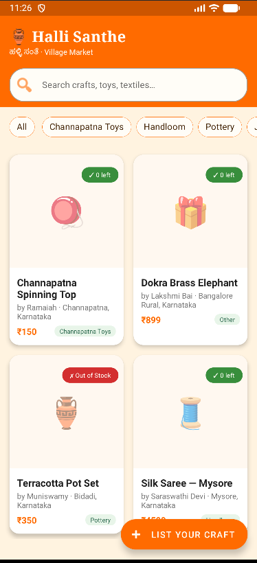
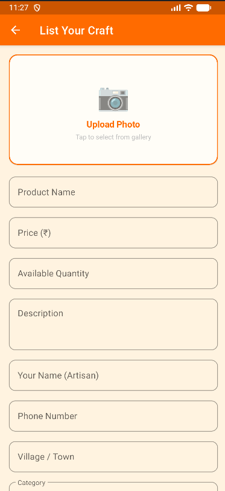
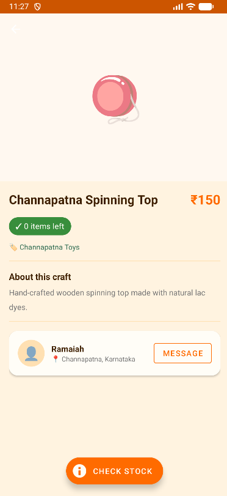

# 🛍️ Halli Santhe – Rural Digital Marketplace (Android App)

## 📌 Overview
Halli Santhe is a full-featured Android marketplace application designed to connect rural vendors and buyers in a simple digital platform. Vendors can upload products with images, price, and details, while users can browse and view products easily.

This project is built using Kotlin and Firebase and demonstrates real-world mobile app development concepts such as authentication, cloud database integration, and dynamic UI rendering.

---

## 🎯 Problem Statement
In rural regions, small vendors lack access to digital platforms to sell their products. Halli Santhe solves this by providing a mobile-based marketplace where vendors can list products and customers can discover them without complexity.

---

## ✨ Key Features

### 🏠 Home Screen
- Displays featured products and categories
- Smooth navigation across app sections

### 🔐 Login Screen
- User authentication interface
- Secure access flow

### 📦 Product Listing
- Displays all products from Firebase
- Shows image, name, price, and description
- RecyclerView-based dynamic UI

### 📄 Product Details Screen
- Full product information view
- Clean and structured layout

### ➕ Product Upload (Vendor Feature)
- Upload product with image, name, price, and description
- Firebase Firestore storage integration
- Firebase Storage for images

---

## 🛠️ Tech Stack

- **Language:** Kotlin  
- **UI:** XML (Material Design Components)  
- **Backend:** Firebase Firestore  
- **Storage:** Firebase Storage  
- **Image Loading:** Glide  
- **Architecture:** Activity-based Android structure  
- **Components:** RecyclerView, CardView  

---

## 📸 Screenshots

### 🏠 Home Screen

### 🔐 Login Screen

### 📦 Product Listing

### 📄 Product Details

---

## ⚙️ Setup Instructions

1. Clone the repository:

git clone https://github.com/YOUR_USERNAME/halli-santhe.git

2.Open in Android Studio
3.Connect Firebase project
4.Add google-services.json inside /app
5.Sync Gradle files
6.Run the application

##🧠 Learning Outcomes
Android app development using Kotlin
Firebase integration (Firestore + Storage)
RecyclerView implementation
Real-time data handling
UI/UX design using Material Components
Git & GitHub version control

##🚀 Future Improvements
Chat between buyer and seller
Payment gateway integration
Wishlist feature
Order tracking system
Location-based product search

##👨‍💻 Developer
Shreya Madhusudan Santubal
Android Developer Intern
Halli Santhe Project
